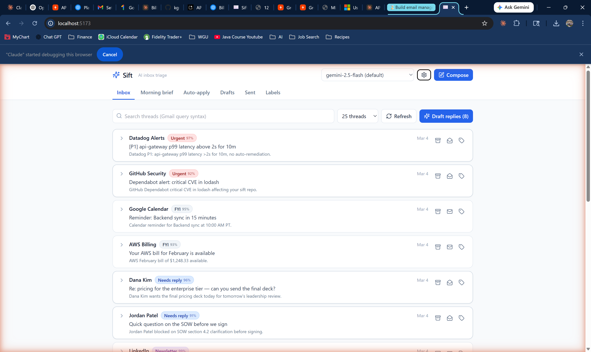
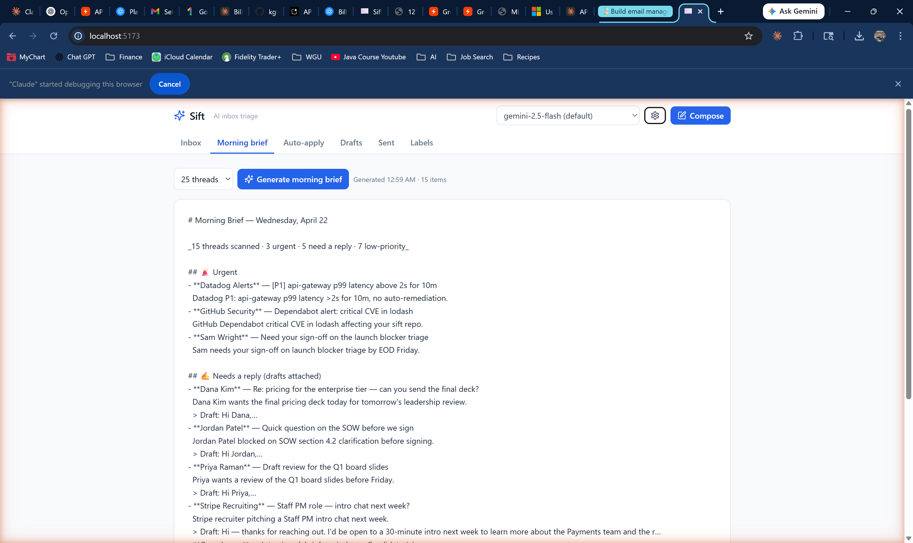
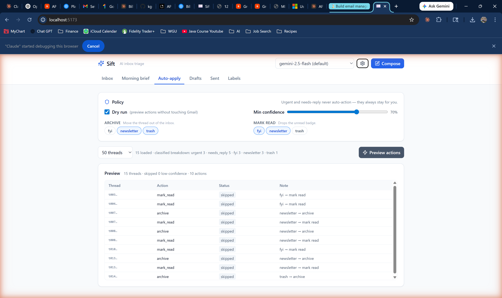
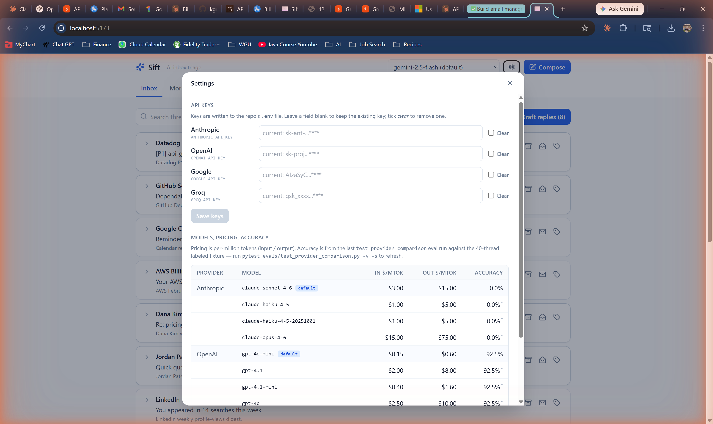

# SiftRobust

**A local-first AI inbox triage tool with a React + FastAPI UI, a multi-provider LLM layer, and a safety-gated action engine that can actually touch Gmail — not just summarize it.**

I built this in ~2 weeks as a portfolio piece while job-searching for PM / SWE / AI-engineering roles. It's meant to show how I use modern AI tools to design, implement, and ship a real product: not a toy, not a wrapper around a single API call, but something I actually run on my own inbox every morning.

> **Transparent about the process:** I wrote this codebase _with_ AI assistance (Claude Code, Copilot-style suggestions, a lot of pair-prompting). Every line here was reviewed, shaped, and tested by me — the architecture, safety model, eval harness, and UX decisions are mine. This README is honest about what that collaboration looks like because the whole point of the project is to demonstrate what I can build when I use AI well.

> **Built by [Kyle Rauch](https://github.com/kgr1115)** · Cincinnati, OH · [kyle.g.rauch@gmail.com](mailto:kyle.g.rauch@gmail.com) · [LinkedIn](https://www.linkedin.com/in/kyle-rauch-b2984a75/)
> Currently looking for Solutions Engineer / TAM / Implementation Consultant / CSE roles at AI-forward SaaS companies. Available immediately.
---

## What it does

Point it at your Gmail inbox and it will:

1. **Classify** every thread into one of five triage buckets — `urgent`, `needs_reply`, `fyi`, `newsletter`, `trash` — with a confidence score, one-line summary, and reason.
2. **Draft replies** in your voice for threads that need one. The voice profile is learned from your Sent folder on first run and cached for 30 days.
3. **Render a morning brief** — a single-call pipeline that produces a markdown rollup you can skim over coffee: urgents up top with drafts attached, FYIs collapsed, newsletter/trash counts at the bottom.
4. **Act on Gmail** via a safety-gated bulk-action engine — archive, label, mark-read, create-label — with a dry-run preview, a confidence floor, and a hard whitelist that makes it impossible to auto-archive an urgent thread.
5. **Swap LLM providers** with no code changes. Anthropic, OpenAI, Google Gemini, and Groq are all behind a single `structured_call` facade. The provider dropdown in the header actually works.

Everything stays local — single user, on your laptop, your OAuth token, your SQLite cache. No server-side accounts, no telemetry.

---

## Screenshots

_Captured against the synthetic fixture inbox — no real messages shown._

**Inbox with per-thread classifications and confidence scores**



**One-click morning brief — urgent items, drafts attached, FYI/newsletter rollup**



**Auto-apply with dry-run preview — safe-category whitelist, confidence floor, per-thread action table**



**Settings dialog — hot-swap providers, inspect pricing and last-eval accuracy**



---

## Why it's a useful portfolio piece

Plenty of "ChatGPT for email" demos stop at "look, it wrote a summary." The interesting problems only start after that:

| Problem | How this project solves it |
| --- | --- |
| **LLMs are non-deterministic — how do you trust the classifier?** | An eval harness (`evals/test_classifier.py`) runs every commit against 40 hand-labeled fixtures and reports accuracy. The provider comparison eval fans the same prompts across 4 providers and writes a markdown scorecard. |
| **What if my API balance runs out mid-task?** | The backend (`src/sift/provider_errors.py`) classifies every provider exception into `auth` / `balance` / `rate_limit` / `bad_request` / `other`. The UI renders a targeted banner with an "Open settings" button so you can swap providers in one click. |
| **How do you let AI touch production data safely?** | Three gates, enforced in code (`src/sift/actions.py`): dry-run default, confidence floor, safe-category whitelist. The backend raises `ValueError` if a policy tries to bulk-archive `urgent` — and there's no UI path that can even construct such a policy. |
| **How do you keep prompts reviewable?** | Prompts live as markdown files in `src/sift/prompts/` so they diff cleanly in PRs and a non-engineer can read them. |
| **How do you avoid vendor lock-in?** | A provider registry (`src/sift/providers/`) maps a common interface over each SDK's tool-use / JSON-mode / response-schema dialect. Adding a new provider is one file. |

---

## Live eval numbers

The latest provider-comparison eval, run against 40 labeled fixtures:

| Provider | Model | Accuracy | Errors | Total cost | $/1k threads | Avg latency |
|----------|-------|---------:|-------:|-----------:|-------------:|------------:|
| groq | `llama-3.3-70b-versatile` | 97.5% | 0 | $0.03 | $0.75 | 5,254 ms |
| anthropic | `claude-sonnet-4-6` | 95.0% | 0 | $0.30 | $7.58 | 3,109 ms |
| openai | `gpt-4o-mini` | 92.5% | 0 | $0.01 | $0.26 | 1,394 ms |
| google | `gemini-2.5-flash` | 92.5% | 0 | $0.02 | $0.60 | 1,019 ms |

Full per-category recall table + token counts are in [`evals/last_provider_comparison.md`](evals/last_provider_comparison.md). Re-run on demand with `pytest evals/test_provider_comparison.py -v -s` (whole suite, any providers with keys set) or `python scripts/run_one_provider.py <name>` (single provider, ~40s).

---

## Stack

| Layer | Tech |
| --- | --- |
| Backend | FastAPI · Pydantic v2 · SQLite · Google API Python client · Python 3.10+ |
| Frontend | React 18 · TypeScript · Vite 6 · Tailwind 3 · TanStack Query v5 · Quill (rich-text) |
| LLM | `anthropic`, `openai` (also used for Groq), `google-genai` SDKs, unified behind a single `structured_call` facade |
| CLI | Typer |
| Eval | pytest harness + hand-labeled JSON fixtures |

---

## Quickstart

```bash
# 1. Python env
python -m venv .venv
source .venv/bin/activate          # Windows: .venv\Scripts\activate
pip install -e '.[dev]'

# 2. Secrets
cp .env.example .env
# Fill in at least one of:
#   ANTHROPIC_API_KEY, OPENAI_API_KEY, GOOGLE_API_KEY, GROQ_API_KEY
# Drop your Gmail OAuth credentials.json in the project root.

# 3. First-time OAuth
sift auth                           # opens the browser, caches token.json

# 4. Run the app
sift serve --web                    # FastAPI on :8000, Vite on :5173
open http://localhost:5173
```

**Don't want to set up Gmail yet?** Every pipeline command accepts `--source fixtures` and runs against 40 hand-labeled synthetic threads:

```bash
sift brief --source fixtures
sift classify --source fixtures
```

See [`docs/gmail_setup.md`](docs/gmail_setup.md) for the full OAuth walkthrough.

---

## CLI

| Command | What it does |
| --- | --- |
| `sift serve [--web]` | Launch the FastAPI backend (and optionally the Vite dev server). |
| `sift brief` | Classify + draft + render the morning brief. |
| `sift classify` | Classifier only (table output). |
| `sift draft <id>` | Draft a reply for a single thread. |
| `sift push-drafts` | Classify + draft + push replies to Gmail Drafts. |
| `sift apply` | Bulk-apply an `ActionPolicy` (dry-run by default). |
| `sift compose` | Send or save-as-draft a new outbound email. |
| `sift auth` | Run the Gmail OAuth flow. |
| `sift learn-voice` | Learn a voice profile from your Sent folder. |
| `sift cache-stats` / `sift cache-clear` | Inspect or wipe the SQLite cache. |

---

## Project layout

```
SiftRobust/
├─ src/sift/
│  ├─ api.py              FastAPI app + Pydantic schemas + typed error envelope
│  ├─ actions.py          Bulk-action engine (dry-run + 3 safety gates)
│  ├─ gmail_client.py     gmail.modify wrapper: read, send, label, draft
│  ├─ classifier.py       urgent / needs_reply / fyi / newsletter / trash
│  ├─ drafter.py          Reply drafting with a learned voice profile
│  ├─ brief.py            Morning-brief builder (deterministic + LLM paths)
│  ├─ voice.py            learn-voice from Sent mail, TTL cache
│  ├─ cache.py            SQLite cache: threads, classifications, drafts, voice
│  ├─ llm.py              Provider-agnostic facade + retry/backoff + logging
│  ├─ provider_errors.py  Exception → error_type classifier (auth/balance/…)
│  ├─ providers/          Anthropic / OpenAI / Google / Groq adapters
│  ├─ prompts/            Markdown prompt templates
│  ├─ models.py           Pydantic: Thread, Classification, Draft, ActionPolicy
│  ├─ catalog.py          Read-only provider/model catalog for the UI
│  ├─ settings.py         Atomic .env upsert + secret masking
│  └─ cli.py              Typer entry point
├─ web/src/
│  ├─ App.tsx
│  ├─ api/client.ts       Typed fetch wrapper + ApiError class
│  └─ components/         ThreadCard, DraftEditor, InboxView, SettingsDialog, …
├─ evals/                 pytest harness + hand-labeled fixtures + scorecard
├─ scripts/               One-off maintenance scripts (single-provider re-eval)
├─ tests/                 Unit tests (safety gates, error classification)
└─ docs/design_decisions.md
```

~4,400 lines of Python + ~2,400 lines of TypeScript.

---

## Safety model

The bulk-action layer takes an `ActionPolicy` and runs it over every classified thread. Three gates, in order:

1. **Dry-run by default.** `ActionPolicy.dry_run` starts `True`. The UI shows you exactly what would happen before anything hits Gmail. You have to flip the toggle yourself.
2. **Confidence floor.** Classifications below `min_confidence` (default 0.7) are skipped entirely.
3. **Safe-categories whitelist.** Only `fyi`, `newsletter`, and `trash` can be bulk-auto-actioned. If a policy targets `urgent` or `needs_reply`, the backend raises `ValueError` at the edge. The UI can't even construct such a policy; the server double-checks anyway.

The "junior-intern pattern": the model clears obvious junk, flags obvious urgents, and the ambiguous middle always stays in front of you.

Full rationale + trade-offs in [`docs/design_decisions.md`](docs/design_decisions.md).

---

## Multi-provider architecture

One classifier prompt, four LLMs. The registry in `src/sift/providers/` maps a uniform interface over each SDK's dialect:

| Provider | Structured-output primitive |
| --- | --- |
| Anthropic | Tool use (forced tool choice) |
| OpenAI (+ Groq via OpenAI-compat) | `response_format={"type": "json_schema"}` |
| Google Gemini | `response_schema` + `response_mime_type="application/json"` |

Calls go through a single `structured_call_full` facade in `src/sift/llm.py` that handles retry/backoff on 429s, honors `Retry-After` headers, and logs every successful call to `logs/<tag>.jsonl` for debugging. Swapping providers is a one-line change in `.env` (`LLM_PROVIDER=...`) or a click in the header dropdown — both routes call the same `/api/settings` endpoint that atomically rewrites `.env`, hot-reloads the config, and clears the cached provider instance so the next call picks up the new key.

---

## Dev loop

```bash
# Backend (hot-reload)
uvicorn sift.api:app --reload

# Frontend
cd web && npm install && npm run dev    # proxies /api/* to :8000

# Tests + evals
pytest                                           # fast unit tests
pytest evals/test_classifier.py -v -s            # classifier accuracy
pytest evals/test_drafter.py -v -s               # drafter-quality eval
pytest evals/test_provider_comparison.py -v -s   # multi-provider bake-off
python scripts/run_one_provider.py anthropic     # ~40s single-provider refresh
```

OpenAPI docs at [`http://localhost:8000/docs`](http://localhost:8000/docs) once the backend is running.

---

## What I'd build next if I kept going

- **Calendar tool-use** — when a thread is "can we meet Thursday?", let the drafter look at my free/busy and propose an actual time.
- **Follow-up tracker** — detect threads I sent a reply on that haven't been answered in N days and surface them.
- **Per-sender learned rules** — "I always archive threads from X" becomes a one-click policy commit.
- **Streaming drafts in the UI** — currently the drafter is a single request/response; the tokens should stream.

---

## Notes on how I built this

A few specific things I'd highlight as a demonstration of effective AI-assisted engineering rather than vibe-coding:

- **Evals before UI.** The classifier eval was the first thing I wrote, before any web code. Every prompt change ran through the 40-fixture suite; the numbers you see in the scorecard are reproducible, not cherry-picked.
- **Safety gates are in code, not prompts.** The model doesn't get to decide whether it's allowed to archive an urgent email. That's a hard `ValueError` at the API edge.
- **Typed error surface.** The frontend knows about `auth` vs `balance` vs `rate_limit` as discriminated types, not string matches on error messages. That kind of up-front schema work is what makes AI-assisted code maintainable instead of a pile of patches.
- **Prompts as first-class files.** Reviewable, diffable, non-engineer-readable. The `classify.md` prompt has been through half a dozen iterations — all visible in `git log`.
- **One facade, four providers.** Writing this portably from day one forced me to understand each SDK's structured-output mechanism instead of getting locked into one vendor's abstraction.
- **Optimized the hot paths once the shape was right.** The first version fetched thread bodies with N serial `threads().get()` calls on every inbox load and re-fetched them on every tab-focus. Once the tool was clearly a keeper I swapped the loop for a single `BatchHttpRequest` multipart call (with a serial fallback if the batch endpoint errors) and added TanStack Query caching with a 60-second stale-time on the inbox and classify queries. Same batching pattern in the voice-learning Sent-folder scan. Boring engineering, but it's the difference between a demo and a tool I actually open every morning.

---

## License

MIT — see [`LICENSE`](LICENSE) if present. If not, treat it as MIT pending a dedicated license file.

---

*Questions, hiring-related or otherwise: kyle.g.rauch@gmail.com*
